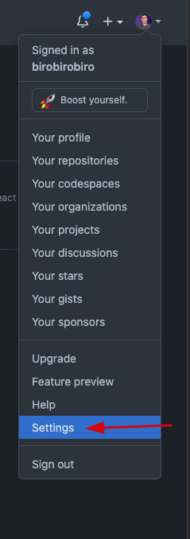
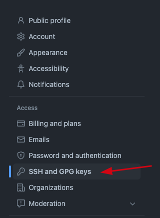
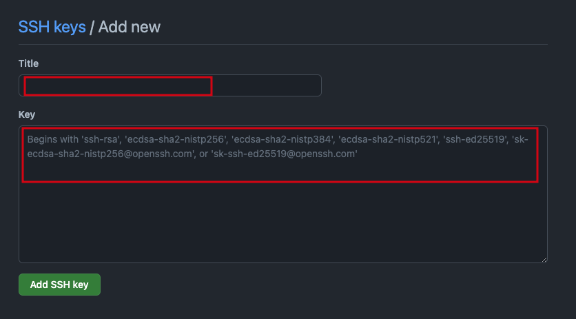
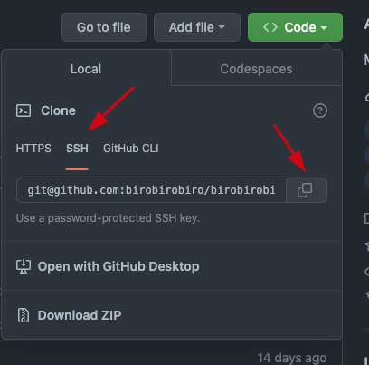

# Github

- O que é o Github? - 01:18
- Criando uma conta - 02:54
- Perfil Público - 05:27
- Página do Usuário - 01:10
- Criando repositório - 02:02
- Git Push - 07:56
- Git Ignore - 07:35
- Git Keep - 01:52
- Histórico Remoto - 01:05
- Git Clone - 05:45
- Git Pull - 04:10
- README - 10:43
- Mudar Visibilidade - 01:28
- Encerramento - 04:31

# Configurando SSH

- O SSH é uma sigla para Secure Shell, um termo e protocolo de um mecanismo de segurança na rede.

## Gerando a chave SSH

1. Abra `Terminal` *(macOS / Linux)* `Git Bash` *(Windows)*

2. Cole o comando abaixo, substituindo o endereço de e-mail pelo seu GitHub.

ssh-keygen -t ed25519 -C `"seuemail@gmail.com"`

3. Isto cria uma nova chave SSH, usando o nome de e-mail fornecido como uma etiqueta.
> Generating public/privatealgorithm key pair.

4. Quando aparecer a solicitação **"Enter a file in which to save the key"**, pressione `ENTER`. 
    
    O local padrão do arquivo será aceito.

> Enter a file in which to save the key (/Users/you/.ssh/id_algorithm): [Press enter]

5. (Opcional) Digite uma senha secreta segura no prompt. Para obter mais informações, consulte ["Trabalhar com frases secretas da chave SSH](https://docs.github.com/pt/articles/working-with-ssh-key-passphrases)".

> Enter passphrase (empty for no passphrase):[Type a passphrase]
> Enter same passphrase again:[Type passphrase again]

6. Inicie o ssh-agent em segundo plano

`eval "$(ssh-agent -s)"`

### Importando para o Github

1. Ainda no terminal, navegue até a pasta onde a chave SSH foi salva com o comando:
`nano ~/.ssh/id_ed25519.pub`

2. Copie o código inteiro que aparecerá no seu terminal e depois pressione CTRL + X para sair

* A estrutura será algo parecido com o exemplo abaixo 👇🏻
<pre>ssh-ed25519 AAbiroAACENzaC1lZDI1biroNTE5BBBBILkGTLMnPXIpbiroT56XhJwRjUrU9C4osFEVYX1Ezys3fe33 oi@rocketsesat.com.br</pre>

3. Acesse as configurações do seu Github

4. Clique em SSH and GPG Keys

5. Clique no botão para criar uma nova chave SSH

6. Adicione um título para sua chave e cole o conteúdo copiado do passo 2 no campo Key e clique em Add SSH Key

7. Agora sempre que for fazer um `git clone`, utilize a opção SSH

- git remote --v
- git clone
